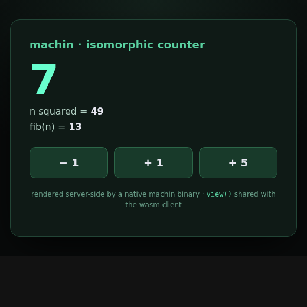

# machin-demo-ssr — isomorphic **server-side rendering** in machin

A counter page rendered **server-side by a single native machin binary** — no
Node, no bundler, no JavaScript required to use it. The catch that makes it
interesting: the view logic lives in **`view.src`**, and *that same file* is
compiled into both halves of the app:

- the **native SSR server** (`server.src` + machweb) → fully-formed HTML per request;
- the **wasm client** (`client.src`, machin v0.50.0 `--target wasm`) → an in-browser SPA.

**One component model, two runtimes.** The server's HTML and the client's
re-render are byte-for-byte identical, because they call the same `view()`.



## The shared component

`view.src` — compiled into the server *and* the wasm client, unchanged:

```go
func fib(n) (r) {
    if n < 2 { r = n } else { r = fib(n - 1) + fib(n - 2) }
}

func view(n) (s) {                                  // int in, HTML fragment out
    s = "<h1>machin · isomorphic counter</h1>"
    s = s + "<div class=big>" + str(n) + "</div>"
    s = s + "<p>n squared = <b>" + str(n * n) + "</b></p>"
    s = s + "<p>fib(n) = <b>" + str(fib(n)) + "</b></p>"
}
```

**Server** (`server.src`, composed with the vendored `machweb.src`): a machweb
handler reads `?n=` and returns `ok_html(page(n))`, where `page()` wraps the
shared `view()` in a document whose +/− controls are plain `<a href="/?n=…">`
links — navigation is a server round-trip, so it works with JavaScript off.

**Client** (`client.src`): `export func render(n) { set_html(view(n)) }` — the
same `view()`, exported from wasm, so a click re-renders in the browser with no
round-trip and produces the exact markup the server sent.

## Why this matters

- **SSR is native-fast and dependency-free.** Rendering a page is just calling a
  pure MFL function to build a string; the server is one static binary. No
  hydration runtime is needed at all for content pages.
- **The same code does SSR and SPA.** Write a component once in MFL; run it on the
  server for first paint and in wasm for interactivity. That's the full-stack
  payoff — one language, one component, both ends of the wire.
- **Machine-first.** The whole thing is canonical MFL an agent can author from
  `machin guide`; the build is `machin encode` + `machin build` — no `npm`, no
  Vite, no `node_modules`.

## Build & run

Needs `machin` (**v0.50.0+** for the wasm client) and — for the client only —
[`zig`](https://ziglang.org).

```sh
./build.sh                       # → ./machin-demo-ssr   (the SSR server)
./machin-demo-ssr                # serves http://localhost:48090/
# open http://localhost:48090/  ·  the − / + links navigate server-side

./build.sh client                # also builds ./app.wasm from the same view.src
```

Confirm the isomorphism — the server and the wasm client emit the same HTML:

```sh
curl -s 'http://localhost:48090/?n=7'   # ...<div class=big>7</div>...fib(n) = <b>13</b>...
# client render(7) via app.wasm produces that identical fragment
```

## What's next

Today the page hydrates only where `app.wasm` is served alongside it. Having the
**machin server serve its own wasm** (and assets) wants a machweb **bytes-body
response** (a `.wasm` has NUL bytes that a C-string body would truncate) — the
next gap to drive, toward a single binary that ships both the SSR HTML and the
SPA bundle. See the
[web north star](https://github.com/javimosch/machin/blob/main/docs/NORTH-STAR-WEB.md).

## License

MIT
